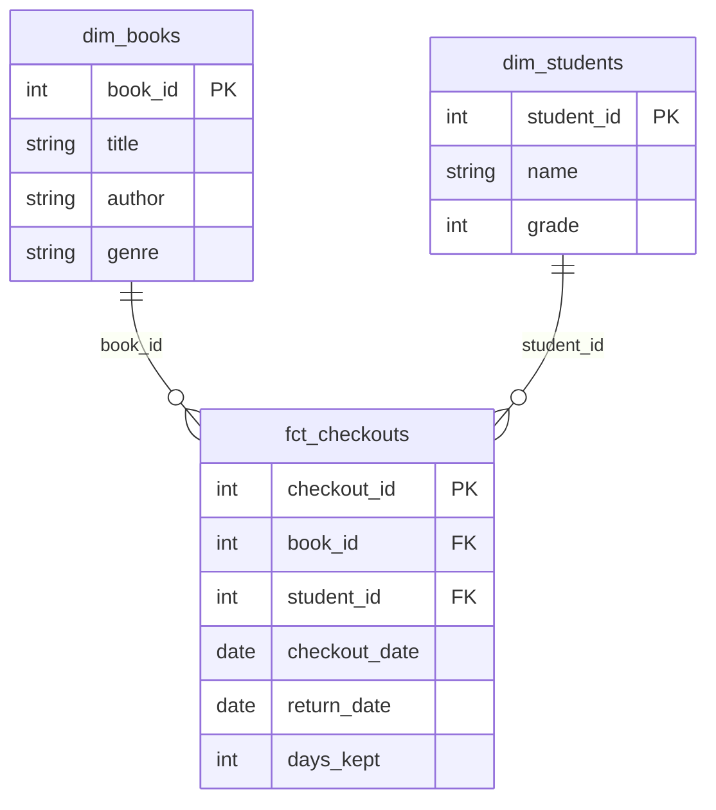

# Dimensional Modeling: Fact Tables, Dimension Tables & Star Schema

## Why Not Just One Big Flat Table?

Imagine storing every book checkout with *everything* crammed into one row — student name, grade, book title, author, genre, all repeated on every single row.

Problems with this approach:
- **Redundancy** — "Charlotte's Web" and "E.B. White" get written thousands of times
- **Update anomalies** — if a book's genre is corrected, you must update every row that book appears in
- **Conceptual confusion** — hard to tell what the row is actually "about": an event, or a description of something?

Dimensional modeling solves this by splitting data into two categories:

| Type | Answers | Grows | Prefix |
|---|---|---|---|
| **Fact table** | "What happened?" | Constantly — every event adds a row | `fct_` |
| **Dimension table** | "Who / what / where?" | Slowly — relatively static reference data | `dim_` |

---

## The Star Schema

Picture one fact table in the center, with dimension tables radiating outward, each linked by a foreign key. Drawn out, it visually resembles a star — the fact table at the center, dimensions as the points.



**How to read this diagram:**
- `dim_books` and `dim_students` are the two "points" of the star — each describes an *entity*, one row per book or per student.
- `fct_checkouts` is the center of the star — one row per *event* (a checkout happening).
- The lines show the relationship: **one** book can appear in **many** checkouts (`||--o{`), and **one** student can have **many** checkouts. The fact table holds the foreign keys (`book_id`, `student_id`) that point back to the dimensions — it never repeats the book's title or the student's name directly.

---

## Example Data

**`dim_books`** — one row per book

| book_id (PK) | title | author | genre |
|---|---|---|---|
| 1 | Charlotte's Web | E.B. White | Fiction |
| 2 | A Brief History of Time | Hawking | Science |

**`dim_students`** — one row per student

| student_id (PK) | name | grade |
|---|---|---|
| 101 | Alice | 5 |
| 102 | Ben | 6 |

**`fct_checkouts`** — one row per checkout *event*

| checkout_id (PK) | book_id (FK) | student_id (FK) | checkout_date | return_date | days_kept |
|---|---|---|---|---|---|
| 9001 | 1 | 101 | 2024-01-05 | 2024-01-12 | 7 |
| 9002 | 2 | 102 | 2024-01-06 | 2024-01-20 | 14 |

Notice: `fct_checkouts` never stores the text "Charlotte's Web" or "Alice" — only the numeric keys `book_id` and `student_id`. To get human-readable names, you `JOIN` to the dimension tables when you query.

---

## Why This Pays Off

**"How many books do we have?"**
```sql
select count(*) from dim_books
```
No join needed — the question is about the dimension itself.

**"How many checkouts happened?"**
```sql
select count(*) from fct_checkouts
```
Also trivial — one table, no joins.

**"Which genre gets checked out the most?"**
```sql
select b.genre, count(*) as checkout_count
from fct_checkouts c
join dim_books b on c.book_id = b.book_id
group by b.genre
order by checkout_count desc
```
One clean join connects the event to its description — this is where the star schema's structure pays off: simple tables, joined only when you need richer context.

---

## The Trade-off

Star schemas favor **query simplicity and storage efficiency** over write simplicity:

- ✅ No redundant text stored across millions of fact rows
- ✅ Dimension attributes (e.g. a corrected genre) updated in exactly one place
- ✅ Fact tables stay lean, fast to scan and aggregate
- ❌ You need a `JOIN` any time you want a human-readable label instead of just a key

For analytics/BI workloads — which is exactly what dbt + BigQuery is built for — this trade-off is almost always worth it. It's the opposite priority of a transactional app database, which optimizes for fast single-row writes rather than large-scale read/aggregation.